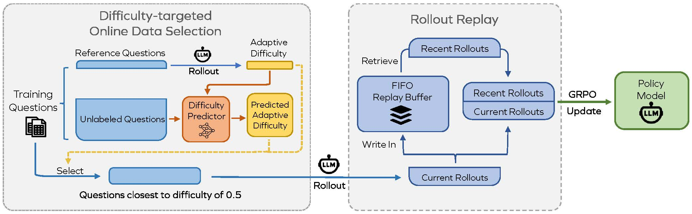

# 🚀 Improving Data Efficiency for LLM Reinforcement Fine-tuning Through Difficulty-targeted Online Data Selection and Rollout Replay

Official Implementation of ["Improving Data Efficiency for LLM Reinforcement Fine-tuning Through Difficulty-targeted Online Data Selection and Rollout Replay"(NeurIPS 2025)](https://arxiv.org/abs/2506.05316).

RL fine-tuning for LLMs is notoriously expensive 💸. We present two simple yet effective techniques to improve data efficiency:

(1) **Difficulty-targeted Online daTa Selection (DOTS)** -> fewer steps to match original GRPO 🚀

(2) **Rollout Replay (RR)** -> lower per-step compute ⚡️



Experiments on six LLM–dataset combinations show that our method reduces RL fine-tuning time by **25%** to **65%** while achieving the same performance as the original GRPO algorithm ⏳.


## ⚙️ Installation

The library has been designed and tested with **Python 3.10** and  **CUDA 12.1**. First, ensure that **CUDA 12.1** is installed, then run the following commands:

```bash
conda create --name rl_data python=3.10
conda activate rl_data

cd rl_training
pip install -e ./verl
pip install -r requirements.txt
```

## 🧠 Training the Adaptive Difficulty Prediction Framework

The core of our difficulty-targeted online data selection lies in the attention-based adaptive difficulty prediction framework.  To achieve this efficiently, we freeze a backbone LLM model (e.g., Qwen2.5-Math-1.5B-Instruct) and augment it with a lightweight adapter and a calibration head. The training process can be launched as follows:

```bash
cd ./adaptive_difficulty_prediction
bash run_bash/run_embed.sh
bash run_bash/run_train.sh
```

## ♻️ Data-efficient RL Training with DOTS and RR

To launch RL training with DOTS and RR, run the following example script (Qwen2.5-Math-1.5B on DeepScaler):

```bash
cd rl_training
bash run_bash/final_ds_teacher_replay.sh
```

# 🙏 Acknowledgement

Part of our codes is based on [rllm](https://github.com/agentica-project/rllm/tree/main) and [verl](https://github.com/volcengine/verl). We gratefully acknowledge their contributions.

# 📚 Citation

If you find our paper helpful, please kindly consider citing our paper in your publication.

```bibtex
@article{sun2025improving,
  title={Improving Data Efficiency for LLM Reinforcement Fine-tuning Through Difficulty-targeted Online Data Selection and Rollout Replay},
  author={Sun, Yifan and Shen, Jingyan and Wang, Yibin and Chen, Tianyu and Wang, Zhendong and Zhou, Mingyuan and Zhang, Huan},
  journal={arXiv preprint arXiv:2506.05316},
  year={2025}
}
